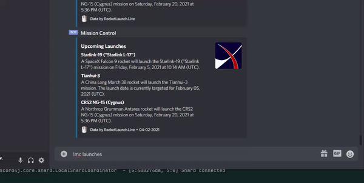

# MissionControlBot
A Discord bot that offers near-real-time information on past and upcoming orbital launches.

### Running the Bot
In order to run the application, you'll first need to add your own private application token as a first command line argument, and your API key for the API at https://www.rocketlaunch.live/api as a second argument.

You can add the bot to your server with this link:
https://discord.com/api/oauth2/authorize?client_id=806567892392083488&permissions=1073867840&scope=bot

### Example

